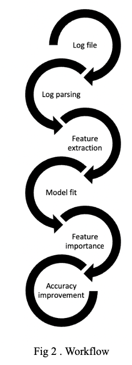

# HDFS log file anomaly detection 

As the technologies are progressing, the data generated from these technologies also keeps increasing. Processing the data and extracting the key information from it becomes of key importance with the growing amount of data. The world of data is so large that for a minute it is absurd to think that even a single click generates an event in the background which is considered as a log message. Log files generally contain all the events associated with a file or a system. These log files are usually kept, to keep track of what is happening in the background and in case of malfunctioning of a system, we can have access to these to check what exactly went wrong. The next important aspect of managing the log files is anomaly detection within the log files. Manually checking for each incoming log and concluding if a log is an anomaly or not is next to impossible considering the number of logs generated by a single system. This project will aim on automating this process of detection of anomalies in log events. This will mainly target Hadoop file system logs. Hadoop Distributed File System is a distributed file system which is highly fault tolerant. It handles large datasets running on commodity hardware. This project will aim on parsing the HDFS log file to fit machine learning models with the highest accuracy to test if any incoming log file is an anomaly or not. The HDFS log file is first parsed using basic tools like excel and python to make it into a readable format post which the data is parsed and wrangled to keep only the required data. With the use of feature extraction technique, each log message is parsed to gather the count of the number of repeated words for each event. This data is then passed to machine learning algorithms with training, test and validation sets to develop a model with low accuracy which predicts if an incoming log message is an anomaly or not based on the training data provided to the model. The events are grouped based on block ids and the time frame to group the events within the samesecondoftime.Thisstepisdonetoensurethereareno multiple events within a second which could be an anomaly like a Bruteforce attack. The parsed and grouped data is then trained and modeled using random forest. Feature extraction technique is used to know the importance of each variable and the unimportant variables are dropped and the model is fit again to improve accuracy.

